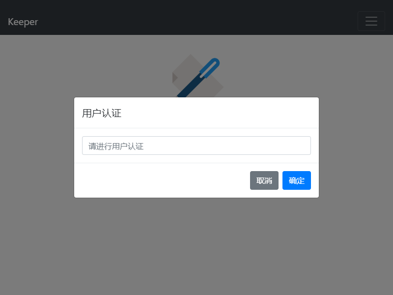
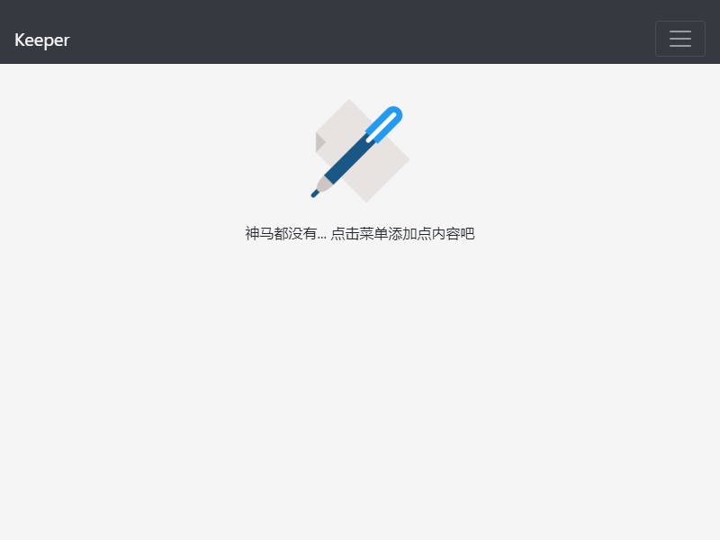
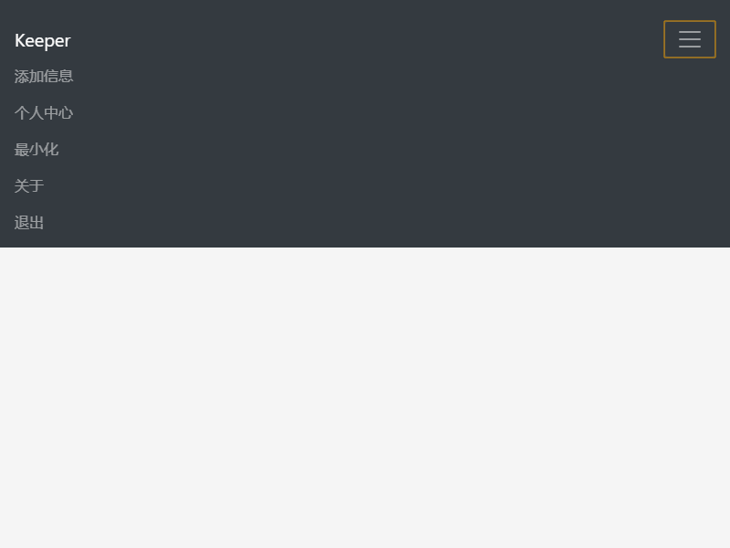
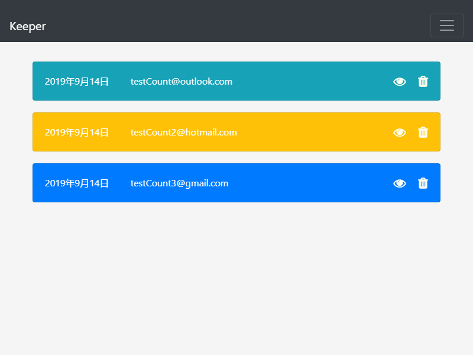
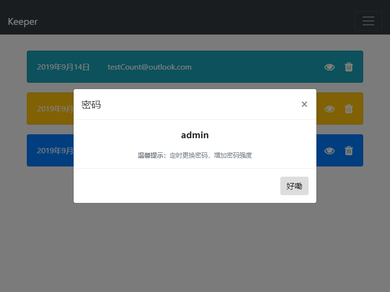
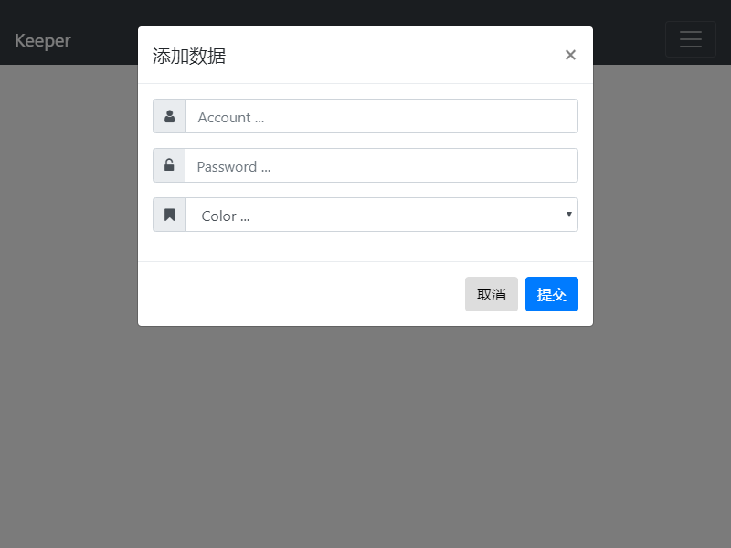
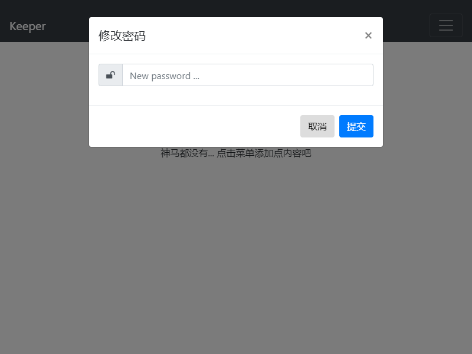
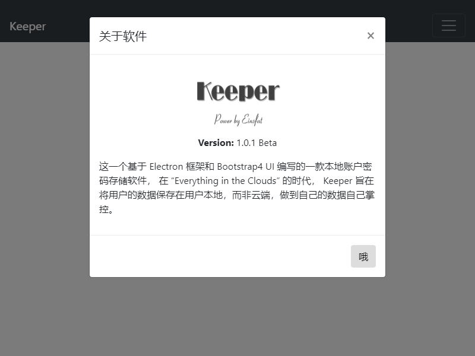

<font face="Georgia">

<center></center>


## 前言
`Keeper`是一个基于`Electron`和`Bootstrap4`框架的本地存储用户的账号和密码的一个桌面软件，目前该软件已经具备基本的功能，但它还是处在"婴儿期"。项目很简单并且基于Apache 2许可协议，这就意味着如果你需要更加高级的功能的话，你可以按照你的意愿进行定制。

当然，您需要掌握基本的前端开发知识。
- [Electron 官网（点击了解）](https://electronjs.org/)
- [Bootstrap4 官网（点击了解）](https://getbootstrap.com/)

## 使用步骤
### 懒人选项
该项目已经为您准备好了完整的开发环境，你只需要将项目代码克隆到本地。
在启动代码之前先将下面的代码进行相应的操作，请按照注释选择其中的**一个**即可

```js
// const adapter = new FileSync('./model/db.json');  // 开发时请使用这个
// const adapter = new FileSync('./resources/app/model/db.json'); // 打包的时候请使用这个
```

#### 命令行启动
使用命令行运行项目之前，请确保进入项目目录。

```shell
electron .
```

#### IDE 启动
你也可以使用`WebStorm`或者`Visual Studio Code`等编辑器进行开发，推荐使用`WebStorm`，使用IDE进行开发的时候，你可以运行项目目录下面的`run.js`脚本进行快速启动。

#### 默认密码
> **admin**

## previous
`Keeper` is a desktop software for the local storage user's account and password based on the `Electron` and `Bootstrap4` frameworks. Currently the software has basic functionality, but it is still in "infancy". The project is simple and based on the Apache 2 license agreement, which means that if you need more advanced features, you can customize it to your liking.

Of course, you need to have basic front-end development knowledge.
- [Electron official website (click to go)](https://electronjs.org/)
- [Bootstrap4 official website (click to go)](https://getbootstrap.com/)

## usage
### Lazy option
The project has prepared a complete development environment for you, you only need to clone the project code locally.Before starting the code, please perform the corresponding operation below, please follow the comments to select one of them.

```js
// const adapter = new FileSync('./model/db.json');  // Please use this when developing
// const adapter = new FileSync('./resources/app/model/db.json'); // Please use this when packing
```

#### Command line startup
Be sure to enter the project directory before running the project using the command line.

```shell
electron .
```

#### IDE startup
You can also use the editors such as `WebStorm` or `Visual Studio Code` for development. It is recommended to use `WebStorm`. When using IDE for development, you can run the `run.js` script below the project directory for quick startup.

#### Default password 
> **admin**

## 软件截图（Screenshot）

<center>
    
    <p>认证界面/login page<p>
    
    <p>主界面(空)/main page (empty)<p>
     
    <p>菜单/menu page<p>
    
    <p>主界面/main page<p>
       
    <p>查看密码/show password</p> 
    
    <p>添加信息/add item<p>
       
    <p>修改密码/modify password</p> 
       
    <p>关于软件/about</p> 
</center>